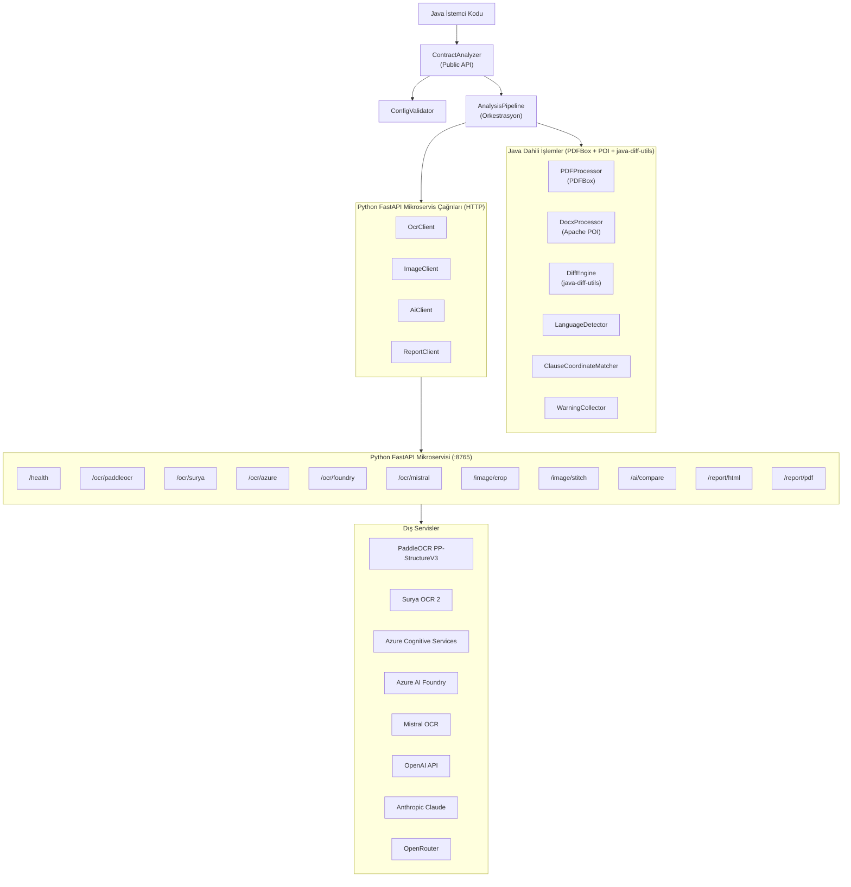
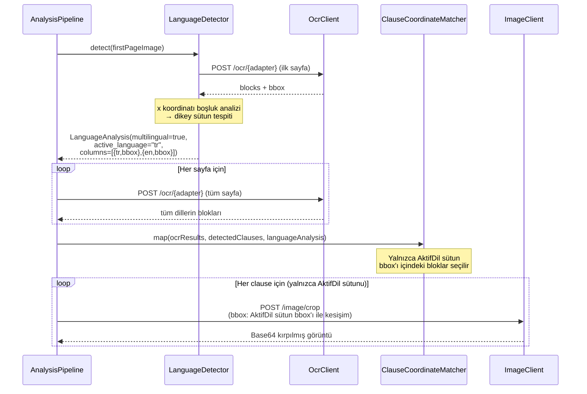
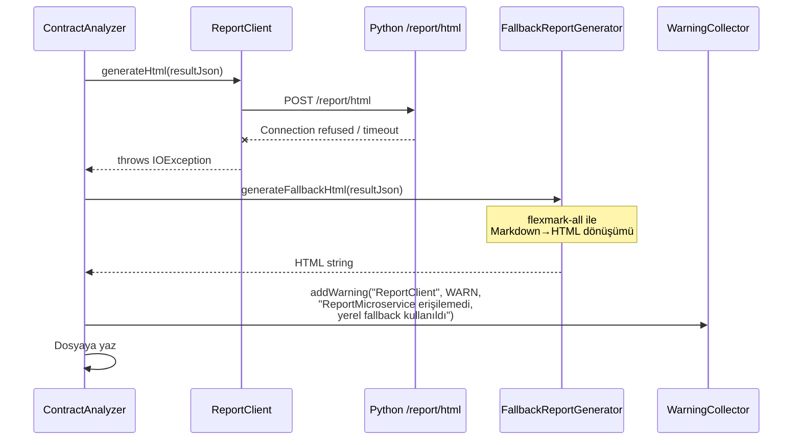

# Design Document: signed-contract-analyzer

## Overview

`signed-contract-analyzer`, taranmış imzalı sözleşme PDF'lerini orijinal Word (.docx) sözleşmeleriyle karşılaştıran bir Java 21 kütüphanesidir. Sistem; OCR, yapay zeka semantik karşılaştırma ve görüntü işleme sorumluluklarını bir Python FastAPI mikroservisine devrettirirken, PDF→görüntü dönüşümü, Word ayrıştırma ve metin diff hesaplama işlemlerini Java tarafında tutmaktadır.

Mimari, **Java library JAR** (iş lojiği orkestrasyonu) ile **Python FastAPI mikroservisi** (dış servis entegrasyonları) arasındaki net sorumluluk ayrımı üzerine inşa edilmiştir. Java hiçbir dış servise (OCR, AI, görüntü işleme) doğrudan bağlanmaz; tüm dış çağrılar Python servisi üzerinden yapılır. Bu tasarım, dış servis değişikliklerinin Java API'sini etkilememesini garantiler.

## Architecture

### Üst Seviye Mimari



### Pipeline Akış Mimarisi

```mermaid
sequenceDiagram
    participant C as İstemci
    participant CA as ContractAnalyzer
    participant CFG as ConfigValidator
    participant PIPE as AnalysisPipeline
    participant PDF as PDFProcessor
    participant LANG as LanguageDetector
    participant OCR as OcrClient→Python
    participant CCM as ClauseCoordinateMatcher
    participant IMG as ImageClient→Python
    participant SIG as SignatureDetector
    participant DOCX as DocxProcessor
    participant DIFF as DiffEngine
    participant AI as AiClient→Python
    participant RPT as ReportAssembler

    C->>CA: config(json).setSignedContractPdf().setOriginalContractDoc().start()
    CA->>CFG: validate(config)
    CFG-->>CA: OK / IllegalArgumentException
    CA->>PIPE: execute()
    
    PIPE->>PDF: convertToPageImages(pdf)
    PDF-->>PIPE: List<PageImage>
    
    PIPE->>LANG: detect(pageImages)
    LANG->>OCR: POST /ocr/{adapter} (ilk sayfa)
    OCR-->>LANG: OcrResult
    LANG-->>PIPE: LanguageAnalysis (multilingual, columns, active_language)
    
    loop Her sayfa için
        PIPE->>OCR: POST /ocr/{adapter} (sayfa görüntüsü)
        OCR-->>PIPE: PageOcrResult (blocks + bbox)
    end

    PIPE->>CCM: mapClausesToBlocks(ocrResults, detectedBBoxes)
    CCM-->>PIPE: List<ClauseMapping>

    loop Her clause için
        PIPE->>IMG: POST /image/crop (sayfa + bbox + margin)
        IMG-->>PIPE: Base64 kırpılmış görüntü
    end

    loop Çok sayfalı clause'lar için
        PIPE->>IMG: POST /image/stitch (görüntü listesi)
        IMG-->>PIPE: Base64 birleştirilmiş görüntü
    end

    PIPE->>SIG: detectSignatures(pageImages, ocrResults)
    SIG->>IMG: POST /image/crop (imza bölgesi)
    IMG-->>SIG: Base64 imza görüntüsü
    SIG-->>PIPE: List<Signer>

    PIPE->>DOCX: parse(docxPath)
    DOCX-->>PIPE: OriginalContract (clauses + additional)

    par Paralel yürütme (CompletableFuture)
        PIPE->>DIFF: diff(signedClause, originalClause)
        DIFF-->>PIPE: DiffResult
    and
        PIPE->>AI: POST /ai/compare (signedContent, originalContent)
        AI-->>PIPE: AiCompareResult
    end

    PIPE->>RPT: assemble(signedContract, originalContract, diffs, aiResults)
    RPT-->>CA: JSONObject (result, signed, original, analysis)
    CA-->>C: getResultJson() / getSignedContractJson() / ...
```



## Components and Interfaces

### Component 1: ContractAnalyzer (Public API Giriş Noktası)

**Amaç**: Tüm pipeline'ı kapsayan, kullanıcı tarafından doğrudan çağrılan tek public sınıf.

**Interface**:
```java
public class ContractAnalyzer {
    public ContractAnalyzer() {}

    /** Yapılandırmayı doğrular ve ayarlar; hatalıysa IllegalArgumentException fırlatır. */
    public ContractAnalyzer config(JSONObject config);

    /** İmzalı PDF yolunu ayarlar; dosya yoksa IllegalArgumentException fırlatır. */
    public ContractAnalyzer setSignedContractPdf(String filePath);

    /** Orijinal .docx yolunu ayarlar; dosya yoksa IllegalArgumentException fırlatır. */
    public ContractAnalyzer setOriginalContractDoc(String filePath);

    /** Tüm pipeline'ı senkron çalıştırır. Yalnızca bir kez çağrılabilir.
     *  @throws ContractAnalysisException pipeline kritik hataları için
     *  @throws IllegalStateException zaten çalıştırılmış instance için */
    public void start() throws ContractAnalysisException;

    /** Tüm analiz sonucunu birleştirilmiş JSON olarak döndürür. */
    public JSONObject getResultJson();

    /** Yalnızca imzalı sözleşme JSON çıktısını döndürür. */
    public JSONObject getSignedContractJson();

    /** Yalnızca orijinal Word sözleşme JSON çıktısını döndürür. */
    public JSONObject getOriginalContractJson();

    /** Yalnızca diff analiz raporunu döndürür. */
    public JSONObject getAnalysisJson();

    /** Pipeline sırasında biriken kritik olmayan uyarıları döndürür. */
    public List<AnalysisWarning> getWarnings();

    /** HTML raporu üretir (Python /report/html; başarısız olursa fallback flexmark). */
    public ContractAnalyzer exportHtml(String outputFilePath) throws ContractAnalysisException;

    /** PDF raporu üretir (Python /report/pdf; başarısız olursa fallback openhtmltopdf). */
    public ContractAnalyzer exportPdf(String outputFilePath) throws ContractAnalysisException;
}
```

**Sorumluluklar**:
- Fluent API ile method chaining desteği
- `config()` → `set*()` → `start()` → `get*()` / `export*()` sırasını zorunlu kılmak
- Pipeline durumunu (`IDLE`, `RUNNING`, `COMPLETED`, `FAILED`) yönetmek
- `AnalysisPipeline` oluşturup çalıştırmak

---

### Component 2: ConfigValidator

**Amaç**: `config(JSONObject)` çağrısında yapılandırma şemasını, tip kontrollerini ve zorunlu alan varlığını doğrular.

**Interface**:
```java
public class ConfigValidator {
    /** Yapılandırmayı doğrular; hatalıysa IllegalArgumentException fırlatır. */
    public void validate(JSONObject config);

    /** Yapılandırmadan tip-güvenli değer okuma yardımcısı. */
    public <T> T getRequired(JSONObject config, String key, Class<T> type);
    public <T> T getOptional(JSONObject config, String key, Class<T> type, T defaultValue);
}
```

**Doğrulama Kuralları**:
- `OCR`: `"PaddleOCR"`, `"Surya"`, `"AzureCognitiveService"`, `"MicrosoftFoundry"`, `"MistralOcr"` değerlerinden biri olmalı
- `AI`: `"OpenAI"`, `"AzureFoundryAI"`, `"ClaudeAI"`, `"OpenRouterAI"` değerlerinden biri olmalı
- `BBOX_MARGIN`: negatif olamaz
- `OCR_CONFIG` / `AI_CONFIG`: seçilen adaptörün zorunlu alanları mevcut olmalı
- `PYTHON_SERVICE_URL`: geçerli URL formatı

---

### Component 3: AnalysisPipeline (Orkestrasyon)

**Amaç**: 12 adımlı analiz sürecini sırayla ve paralel olarak koordine eder.

**Interface**:
```java
public class AnalysisPipeline {
    public AnalysisPipeline(PipelineConfig config, WarningCollector warnings) {}

    /** Tüm pipeline adımlarını yürütür. */
    public PipelineResult execute(String pdfPath, String docxPath) 
        throws ContractAnalysisException;
}
```

**Pipeline Adımları (execute içinde)**:
1. `PDFProcessor.validate(pdfPath)` → PDF doğrulama
2. `PDFProcessor.convertToPageImages(pdfPath)` → `List<PageImage>`
3. `LanguageDetector.detect(pageImages)` → `LanguageAnalysis`
4. Her sayfa için `OcrClient.performOcr(pageImage)` → `PageOcrResult`
5. `ClauseCoordinateMatcher.map(ocrResults)` → `List<ClauseMapping>`
6. Her clause için `ImageClient.crop(pageImage, bbox, margin)` → Base64 görüntü
7. Çok sayfalı clause'lar için `ImageClient.stitch(images)` → Base64 birleşik görüntü
8. `SignatureDetector.detect(pageImages, ocrResults)` → `List<Signer>`
9. `DocxProcessor.parse(docxPath)` → `OriginalContract`
10. `CompletableFuture` ile paralel:
    - `DiffEngine.diff(signedClause, originalClause)` → `DiffResult`
    - `AiClient.compare(signedContent, originalContent)` → `AiCompareResult`
11. `ReportAssembler.assemble(...)` → `PipelineResult`

---

### Component 4: PDFProcessor

**Amaç**: PDF doğrulama ve sayfa görüntüsüne dönüştürme (Apache PDFBox).

**Interface**:
```java
public class PDFProcessor {
    /** PDF'yi doğrular: format, bozukluk, şifre, dosya boyutu. */
    public void validate(String pdfPath) throws ContractAnalysisException;

    /** Her sayfayı 300 DPI BufferedImage'a dönüştürür. */
    public List<PageImage> convertToPageImages(String pdfPath) throws ContractAnalysisException;
}
```

**Sorumluluklar**:
- Yalnızca PDF formatı (magic byte doğrulama)
- Şifreli PDF tespiti
- `MAX_FILE_SIZE_MB` kontrolü
- 300 DPI çözünürlük garantisi
- 1–500 sayfa sınırı

---

### Component 5: LanguageDetector

**Amaç**: İlk sayfa OCR çıktısını analiz ederek tek/çok dilli yapı ve kolon düzenini tespit eder.

**Interface**:
```java
public class LanguageDetector {
    public LanguageDetector(OcrClient ocrClient) {}

    /** Dil ve kolon analizini yürütür. */
    public LanguageAnalysis detect(List<PageImage> pageImages) throws ContractAnalysisException;
}
```

**Sorumluluklar**:
- İlk sayfa OCR çağrısı (Python `/ocr/{adapter}`)
- Dikey sütun tespiti (x koordinatı boşluk analizi)
- `PRIMARY_LANGUAGE` config override desteği
- Belirsizlik durumunda tek dilli varsayım + WARN

---

### Component 6: ClauseCoordinateMatcher

**Amaç**: Sayfa OCR bloklarını clause BoundingBox koordinatlarıyla çakıştırarak her clause'un metin içeriğini derler.

**Interface**:
```java
public class ClauseCoordinateMatcher {
    /** OCR bloklarını ve tespit edilen bbox'ları alarak clause–içerik eşlemesi üretir. */
    public List<ClauseMapping> map(
        List<PageOcrResult> ocrResults,
        List<DetectedClause> detectedClauses,
        LanguageAnalysis languageAnalysis
    );
}
```

**Kesişim Algoritması**:
- Bir OCR bloğunun koordinat merkezi bir clause bbox'ı içindeyse → o clause'a ait
- Çok dilli düzende yalnızca `active_language` sütun bbox'ı içindeki bloklar dahil edilir
- Boş clause → WARN + `content: ""`

---

### Component 7: DocxProcessor

**Amaç**: Word (.docx) dosyasını Apache POI ile ayrıştırıp yapısal clause verisine dönüştürür.

**Interface**:
```java
public class DocxProcessor {
    /** DOCX dosyasını doğrular ve clause'lara ayrıştırır. */
    public OriginalContract parse(String docxPath) throws ContractAnalysisException;
}
```

**Sorumluluklar**:
- XXE korumalı SAX ayrıştırma
- Regex + heading stili ile clause sınırı tespiti: `^\d+(\.\d+)*\.?\s`
- Markdown çıktı üretimi (tablolar Markdown tablo olarak)
- `additional` bölümü tespiti (Ek Protokol, Ek-1 vb.)
- Yinelenen madde numarası tespiti → `-duplicate-N` sonek

---

### Component 8: DiffEngine

**Amaç**: İmzalı OCR metnini orijinal DOCX metniyle java-diff-utils kullanarak karşılaştırır.

**Interface**:
```java
public class DiffEngine {
    /** İki Markdown içerik arasındaki metin farkını hesaplar. */
    public DiffResult diff(String signedMarkdown, String originalMarkdown);

    /** Tüm clause'lar için diff'i hesaplar (CompletableFuture içinden çağrılır). */
    public Map<String, DiffResult> diffAll(
        Map<String, String> signedClauses,
        Map<String, String> originalClauses,
        int maxConcurrency
    );
}
```

---

### Component 9: SignatureDetector

**Amaç**: Sayfa OCR bloklarında `type: "signature"` olanları tespit edip imzacı bilgilerini çıkarır.

**Interface**:
```java
public class SignatureDetector {
    public SignatureDetector(ImageClient imageClient) {}

    /** İmza bloklarını tespit eder, kırpar, imzacı adını bulur. */
    public List<Signer> detect(
        List<PageImage> pageImages,
        List<PageOcrResult> ocrResults
    ) throws ContractAnalysisException;
}
```

---

### Component 10: ReportAssembler

**Amaç**: Tüm pipeline çıktılarını requirements'ta tanımlanan JSON yapısına derler.

**Interface**:
```java
public class ReportAssembler {
    /** Tüm bileşen çıktılarını birleştirerek PipelineResult üretir. */
    public PipelineResult assemble(
        SignedContract signedContract,
        OriginalContract originalContract,
        Map<String, DiffResult> diffs,
        Map<String, AiCompareResult> aiResults,
        LanguageAnalysis languageAnalysis,
        List<Signer> signers
    );
}
```

---

### Component 11: HTTP Client'lar (Java→Python)

**Amaç**: Java 11+ `HttpClient` kullanarak Python mikroservisine tüm HTTP çağrılarını soyutlar.

```java
public class OcrClient {
    public OcrClient(String baseUrl, String apiKey, String adapter) {}
    public PageOcrResult performOcr(PageImage pageImage, String language) 
        throws ContractAnalysisException;
}

public class ImageClient {
    public ImageClient(String baseUrl, String apiKey) {}
    public String crop(String base64Image, BoundingBox bbox, int margin,
                       Integer maxDimensionPx, Double compressionQuality)
        throws ContractAnalysisException;
    public String stitch(List<String> base64Images, int gapPx)
        throws ContractAnalysisException;
}

public class AiClient {
    public AiClient(String baseUrl, String apiKey) {}
    public AiCompareResult compare(String signedContent, String originalContent,
                                   LanguageAnalysis languageAnalysis)
        throws ContractAnalysisException;
}

public class ReportClient {
    public ReportClient(String baseUrl, String apiKey) {}
    public String generateHtml(JSONObject resultJson) throws ContractAnalysisException;
    public byte[] generatePdf(JSONObject resultJson) throws ContractAnalysisException;
}
```

---

### Component 12: RateLimiter

**Amaç**: AI ve OCR çağrılarında eşzamanlı istek sayısını sınırlandırır.

```java
public class RateLimiter {
    public RateLimiter(int maxConcurrency) {}
    public <T> CompletableFuture<T> submit(Callable<T> task);
    public void shutdown();
}
```

**Özellikler**:
- `Semaphore` tabanlı eşzamanlılık kontrolü
- HTTP 429 için üstel geri çekilme (max 3 yeniden deneme: 1s, 2s, 4s)

---

### Component 13: WarningCollector

**Amaç**: Pipeline boyunca kritik olmayan uyarıları toplar.

```java
public class WarningCollector {
    public void addWarning(String component, Severity severity, String message);
    public List<AnalysisWarning> getWarnings();
    public void clear();
}
```

## Python Service Endpoints and Models

### Endpoint Özeti

| Method | Path | Auth | Açıklama |
|--------|------|------|----------|
| GET | `/health` | ❌ Yok | Servis sağlık kontrolü |
| POST | `/ocr/paddleocr` | ✅ API Key | PaddleOCR PP-StructureV3 |
| POST | `/ocr/surya` | ✅ API Key | Surya OCR 2 |
| POST | `/ocr/azure` | ✅ API Key | Azure Cognitive Services |
| POST | `/ocr/foundry` | ✅ API Key | Azure AI Foundry |
| POST | `/ocr/mistral` | ✅ API Key | Mistral OCR |
| POST | `/image/crop` | ✅ API Key | BBox kırpma + ölçekleme |
| POST | `/image/stitch` | ✅ API Key | Dikey görüntü birleştirme |
| POST | `/ai/compare` | ✅ API Key | AI semantik karşılaştırma |
| POST | `/report/html` | ✅ API Key | Jinja2 HTML raporu |
| POST | `/report/pdf` | ✅ API Key | WeasyPrint PDF raporu |

### Request / Response Modelleri (Pydantic)

```python
# ─── OCR Endpoint'leri ───────────────────────────────────────────

class OcrRequest(BaseModel):
    image: str              # Base64 kodlu sayfa görüntüsü
    language: str = "tr"    # ISO 639-1 dil kodu
    config: dict = {}       # Adaptöre özgü ek parametreler

class OcrBlock(BaseModel):
    type: str               # text | title | paragraph | table | image | signature
    bbox: BoundingBoxModel  # x, y, width, height (piksel)
    content: str            # Markdown formatında metin
    confidence: Optional[float]  # 0.0–1.0; desteklenmiyor → null

class BoundingBoxModel(BaseModel):
    x: int
    y: int
    width: int
    height: int

class OcrResponse(BaseModel):
    blocks: List[OcrBlock]
    page_width: int
    page_height: int

# ─── Image Endpoint'leri ─────────────────────────────────────────

class CropRequest(BaseModel):
    image: str                          # Base64 sayfa görüntüsü
    bbox: BoundingBoxModel              # Kırpma koordinatları
    margin: int = 5                     # Her yöne piksel boşluğu
    max_dimension_px: Optional[int] = 2000   # Uzun kenar limiti
    compression_quality: Optional[float] = 0.85  # JPEG kalitesi

class CropResponse(BaseModel):
    image: str    # Base64 kırpılmış görüntü
    format: str   # "jpeg" | "png"

class StitchRequest(BaseModel):
    images: List[str]       # Sıralı Base64 görüntü listesi
    direction: str = "vertical"
    gap_px: int = 2

class StitchResponse(BaseModel):
    image: str
    format: str

# ─── AI Compare Endpoint ─────────────────────────────────────────

class AiCompareRequest(BaseModel):
    clause_number: str
    signed_content: str         # Markdown formatında imzalı içerik
    original_content: str       # Markdown formatında orijinal içerik
    language_hint: Optional[str]        # Aktif dil (tr, en, ...)
    multilingual_note: Optional[str]    # Çok dilli uyarı metni

class AiCompareResponse(BaseModel):
    changes: Optional[bool]   # null → servis erişim hatası
    result: str               # Markdown formatında AI değerlendirmesi

# ─── Report Endpoint'leri ────────────────────────────────────────

class ReportRequest(BaseModel):
    signed_contract: dict    # Req 7.1 JSON yapısı
    original_contract: dict  # Req 9.7 JSON yapısı
    analysis: dict           # Req 12.1 JSON yapısı

# Yanıtlar: HTML → text/html; charset=UTF-8 | PDF → application/pdf (binary)
```

### Python Servis İç Yapısı

```
python-service/
├── main.py                  # FastAPI app, lifespan, middleware
├── config.py                # .env yükleme, ayar doğrulama
├── auth.py                  # API key doğrulama dependency
├── routers/
│   ├── health.py
│   ├── ocr.py               # /ocr/* endpoint'leri
│   ├── image.py             # /image/crop, /image/stitch
│   ├── ai.py                # /ai/compare
│   └── report.py            # /report/html, /report/pdf
├── adapters/
│   ├── ocr/
│   │   ├── base.py          # OcrAdapter abstract class
│   │   ├── paddleocr_adapter.py
│   │   ├── surya_adapter.py
│   │   ├── azure_adapter.py
│   │   ├── foundry_adapter.py
│   │   └── mistral_adapter.py
│   └── ai/
│       ├── base.py          # AiAdapter abstract class
│       ├── openai_adapter.py
│       ├── azure_foundry_adapter.py
│       ├── claude_adapter.py
│       └── openrouter_adapter.py
├── services/
│   ├── image_service.py     # Pillow crop + stitch
│   └── report_service.py    # Jinja2 + WeasyPrint
├── templates/
│   └── report-template.html # Tek rapor şablonu (HTML + PDF)
└── requirements.txt
```

### OcrAdapter ve AiAdapter Arayüzleri (Python)

```python
# adapters/ocr/base.py
from abc import ABC, abstractmethod
from models import OcrRequest, OcrResponse

class OcrAdapter(ABC):
    """Tüm OCR adaptörlerinin uygulaması gereken temel arayüz."""

    @abstractmethod
    async def perform_ocr(self, request: OcrRequest) -> OcrResponse:
        """Verilen sayfa görüntüsü üzerinde OCR yürütür.
        
        Args:
            request: Base64 görüntü + dil + ek config
        Returns:
            OcrResponse: Tespit edilen bloklar ve koordinatlar
        Raises:
            OcrServiceException: Servis erişim hatası durumunda
        """
        ...

    @abstractmethod
    def get_adapter_name(self) -> str:
        """Adaptör adını döndürür (loglama için)."""
        ...
```

```python
# adapters/ai/base.py
from abc import ABC, abstractmethod
from models import AiCompareRequest, AiCompareResponse

class AiAdapter(ABC):
    """Tüm AI karşılaştırma adaptörlerinin uygulaması gereken temel arayüz."""

    @abstractmethod
    async def compare(self, request: AiCompareRequest) -> AiCompareResponse:
        """İki madde içeriğini semantik olarak karşılaştırır.
        
        Args:
            request: İmzalı içerik + orijinal içerik + dil bilgisi
        Returns:
            AiCompareResponse: changes (bool|null) + Markdown result
        Raises:
            AiServiceException: Servis erişim hatası durumunda
        """
        ...

    @abstractmethod
    def get_adapter_name(self) -> str:
        ...
```

## Data Models

### Signed Contract JSON (getSignedContractJson)

```json
{
  "title": "Hizmet Sözleşmesi",
  "clauses": {
    "1": {
      "content": "## 1. Taraflar\n\nBu sözleşme...",
      "image": "<base64-jpeg>"
    },
    "1.1": {
      "content": "### 1.1 Hizmet Alıcı\n\n...",
      "image": "<base64-jpeg>"
    }
  },
  "signers": [
    { "name": "Ahmet Yılmaz", "image": "<base64-jpeg>" },
    { "name": "Ayşe Kaya",   "image": "<base64-jpeg>" }
  ],
  "additional": [
    { "type": "protocol",  "content": "## Ek Protokol 1\n\n..." },
    { "type": "appendix",  "content": "## Ek-1\n\n..." }
  ],
  "language_analysis": {
    "multilingual": true,
    "active_language": "tr",
    "columns": [
      { "index": 0, "language": "tr",
        "bbox": { "x_start": 0, "x_end": 400, "y_start": 0, "y_end": 2339 } },
      { "index": 1, "language": "en",
        "bbox": { "x_start": 420, "x_end": 820, "y_start": 0, "y_end": 2339 } }
    ]
  }
}
```

### Original Contract JSON (getOriginalContractJson)

```json
{
  "title": "Hizmet Sözleşmesi",
  "clauses": {
    "1":   { "content": "## 1. Taraflar\n\nBu sözleşme..." },
    "1.1": { "content": "### 1.1 Hizmet Alıcı\n\n..." }
  },
  "additional": [
    { "type": "protocol", "content": "## Ek Protokol 1\n\n..." }
  ]
}
```

### Analysis JSON (getAnalysisJson)

```json
{
  "analyze_clauses": {
    "1": {
      "signed_image":    "<base64-jpeg>",
      "signed_content":  "## 1. Taraflar\n\nBu sözleşme...",
      "original_content":"## 1. Taraflar\n\nBu sözleşme...",
      "diff": {
        "changes": false,
        "result":  ""
      },
      "diff_ai": {
        "changes": false,
        "result":  "Maddeler anlam bakımından aynıdır."
      }
    },
    "5": {
      "signed_image":    "<base64-jpeg>",
      "signed_content":  "## 5. Ücret\n\n**1.200 TL**",
      "original_content":"## 5. Ücret\n\n**1.000 TL**",
      "diff": {
        "changes": true,
        "result":  "- ~~1.000 TL~~\n+ **1.200 TL**"
      },
      "diff_ai": {
        "changes": true,
        "result":  "Ücret miktarı 1.000 TL'den 1.200 TL'ye yükseltilmiştir."
      }
    }
  }
}
```

### getResultJson Yapısı

```json
{
  "signed_contract":   { /* getSignedContractJson içeriği */ },
  "original_contract": { /* getOriginalContractJson içeriği */ },
  "analysis":          { /* getAnalysisJson içeriği */ }
}
```

### Dahili Java Veri Modelleri

```java
// Sayfa görüntüsü kapsayıcı
public record PageImage(
    int pageNumber,
    BufferedImage image,
    int widthPx,
    int heightPx
) {}

// OCR blok sonucu
public record OcrBlock(
    String type,           // text | title | paragraph | table | image | signature
    BoundingBox bbox,
    String content,        // Markdown
    Double confidence      // null → desteklenmiyor
) {}

// Sayfa bazında OCR sonucu
public record PageOcrResult(
    int pageNumber,
    List<OcrBlock> blocks,
    int pageWidthPx,
    int pageHeightPx
) {}

// Clause–OCR blok eşlemesi
public record ClauseMapping(
    String clauseNumber,
    List<Integer> pageNumbers,
    List<BoundingBox> bboxPerPage,
    List<OcrBlock> blocks,   // Koordinat eşleşmesiyle seçilen bloklar
    String markdownContent
) {}

// Dil analizi sonucu
public record LanguageAnalysis(
    boolean multilingual,
    String activeLanguage,
    List<ColumnInfo> columns
) {}

public record ColumnInfo(
    int index,
    String language,
    ColumnBBox bbox
) {}

public record ColumnBBox(int xStart, int xEnd, int yStart, int yEnd) {}

// BoundingBox
public record BoundingBox(int x, int y, int width, int height) {
    public BoundingBox withMargin(int margin, int pageW, int pageH) {
        return new BoundingBox(
            Math.max(0, x - margin),
            Math.max(0, y - margin),
            Math.min(pageW - Math.max(0, x - margin), width + 2 * margin),
            Math.min(pageH - Math.max(0, y - margin), height + 2 * margin)
        );
    }
}

// Diff sonucu
public record DiffResult(boolean changes, String result) {}

// AI karşılaştırma sonucu
public record AiCompareResult(Boolean changes, String result) {} // changes null → hata

// İmzacı
public record Signer(String name, String base64Image) {}

// Uyarı
public record AnalysisWarning(String component, Severity severity, String message) {}
public enum Severity { WARN, ERROR }

// Pipeline yapılandırması
public record PipelineConfig(
    String ocrAdapter,
    JSONObject ocrConfig,
    String aiAdapter,
    JSONObject aiConfig,
    int bboxMargin,
    String pythonServiceUrl,
    String pythonServiceApiKey,
    int aiMaxConcurrency,      // varsayılan: 5
    int ocrMaxConcurrency,     // varsayılan: 3
    long retentionSeconds,     // varsayılan: 0
    long maxFileSizeMb,        // varsayılan: 100
    int maxResultSizeMb,       // varsayılan: 50
    String primaryLanguage,    // null → otomatik tespit
    String logFilePath,        // null → yalnızca konsol
    String logFormat           // "plain" | "json"
) {}
```

## Error Handling

### Hata Kategorileri

| Hata Türü | Kapsam | Davranış | Java Exception |
|-----------|--------|----------|----------------|
| Geçersiz dosya formatı | PDF/DOCX | Anında durdur | `IllegalArgumentException` |
| Bozuk/şifreli dosya | PDF/DOCX | Anında durdur | `ContractAnalysisException` |
| Python servis bağlantı hatası | OCR/AI/Image/Report | Retry (max 3, exp. backoff) | `ContractAnalysisException` |
| HTTP 401 (API key hata) | Python servis | Anında durdur | `ContractAnalysisException` |
| HTTP 429 (Rate limit) | Python servis | Retry (max 3, exp. backoff) | WARN + devam |
| HTTP 5xx (Sunucu hatası) | Python servis | Fallback + WARN | WARN + devam |
| Clause tespit edilemedi | Madde tespiti | WARN + boş içerik | `AnalysisWarning` |
| OCR sayfası başarısız | OCR | WARN + boş içerik | `AnalysisWarning` |
| İmzacı adı okunamadı | İmza tespiti | WARN + name="" | `AnalysisWarning` |
| AI servis erişim hatası | AI karşılaştırma | `changes: null` + WARN | `AnalysisWarning` |
| Report servisi erişilemez | Rapor üretimi | Fallback (flexmark/openhtmltopdf) | `AnalysisWarning` |
| start() ikinci kez çağrıldı | ContractAnalyzer | Anında durdur | `IllegalStateException` |
| Geçici dosya silinemedi | Temizlik | WARN + devam | `AnalysisWarning` |

### Python Servis Hata Yanıtları

```python
# Tüm hata yanıtları standart format kullanır
class ErrorResponse(BaseModel):
    error: str      # Hata kodu (OCR_FAILED, AUTH_ERROR, ...)
    detail: str     # Açıklayıcı mesaj
    component: str  # Hatayı üreten bileşen

# HTTP durum kodları:
# 200 OK          → başarı
# 400 Bad Request → geçersiz istek parametresi
# 401 Unauthorized → eksik/hatalı API key
# 413 Payload Too Large → body boyut aşımı
# 422 Unprocessable → Pydantic doğrulama hatası
# 500 Internal → beklenmeyen sunucu hatası
# 503 Service Unavailable → dış OCR/AI servis erişilemez
```

### Fallback Mekanizması (Report Üretimi)

```
exportHtml() çağrıldı
        │
        ▼
POST /report/html
        │
   ┌────┴────┐
   │ Başarı  │ → HTML dosyaya yaz
   └─────────┘
        │ Bağlantı hatası / 5xx
        ▼
  flexmark-all ile
  yerel HTML üret → WARN ekle → dosyaya yaz
        │
        ▼
  401 Unauthorized?
        │
        ▼
  ContractAnalysisException fırlat (fallback YOK)
```

## Project Directory Structure

```
signed-contract-analyzer/
├── build.gradle                          # Gradle build (Java 21 library JAR)
├── settings.gradle
├── README.md
│
├── src/
│   ├── main/
│   │   └── java/
│   │       └── com/
│   │           └── signedcontract/
│   │               ├── ContractAnalyzer.java          # Public API
│   │               ├── ContractAnalysisException.java # Checked exception
│   │               ├── AnalysisWarning.java
│   │               ├── Severity.java
│   │               │
│   │               ├── config/
│   │               │   ├── PipelineConfig.java
│   │               │   └── ConfigValidator.java
│   │               │
│   │               ├── pipeline/
│   │               │   ├── AnalysisPipeline.java
│   │               │   └── PipelineResult.java
│   │               │
│   │               ├── processor/
│   │               │   ├── PDFProcessor.java
│   │               │   └── DocxProcessor.java
│   │               │
│   │               ├── ocr/
│   │               │   └── LanguageDetector.java
│   │               │
│   │               ├── clause/
│   │               │   ├── ClauseCoordinateMatcher.java
│   │               │   ├── SignatureDetector.java
│   │               │   └── ClauseMapping.java
│   │               │
│   │               ├── diff/
│   │               │   └── DiffEngine.java
│   │               │
│   │               ├── report/
│   │               │   └── ReportAssembler.java
│   │               │
│   │               ├── client/
│   │               │   ├── OcrClient.java
│   │               │   ├── ImageClient.java
│   │               │   ├── AiClient.java
│   │               │   └── ReportClient.java
│   │               │
│   │               ├── ratelimit/
│   │               │   └── RateLimiter.java
│   │               │
│   │               ├── warning/
│   │               │   └── WarningCollector.java
│   │               │
│   │               └── model/
│   │                   ├── PageImage.java
│   │                   ├── OcrBlock.java
│   │                   ├── PageOcrResult.java
│   │                   ├── BoundingBox.java
│   │                   ├── LanguageAnalysis.java
│   │                   ├── ColumnInfo.java
│   │                   ├── DiffResult.java
│   │                   ├── AiCompareResult.java
│   │                   ├── Signer.java
│   │                   ├── SignedContract.java
│   │                   ├── OriginalContract.java
│   │                   └── PipelineConfig.java
│   │
│   └── test/
│       └── java/
│           └── com/
│               └── signedcontract/
│                   ├── ContractAnalyzerTest.java
│                   ├── config/
│                   │   └── ConfigValidatorTest.java
│                   ├── processor/
│                   │   ├── PDFProcessorTest.java
│                   │   └── DocxProcessorTest.java
│                   ├── clause/
│                   │   └── ClauseCoordinateMatcherTest.java
│                   ├── diff/
│                   │   └── DiffEngineTest.java
│                   └── integration/
│                       └── SampleContractIntegrationTest.java
│
├── python-service/
│   ├── .env.example
│   ├── requirements.txt
│   ├── main.py
│   ├── config.py
│   ├── auth.py
│   ├── start-service.bat
│   ├── stop-service.bat
│   ├── check-health.bat
│   ├── install.bat
│   │
│   ├── routers/
│   │   ├── health.py
│   │   ├── ocr.py
│   │   ├── image.py
│   │   ├── ai.py
│   │   └── report.py
│   │
│   ├── adapters/
│   │   ├── ocr/
│   │   │   ├── base.py
│   │   │   ├── paddleocr_adapter.py
│   │   │   ├── surya_adapter.py
│   │   │   ├── azure_adapter.py
│   │   │   ├── foundry_adapter.py
│   │   │   └── mistral_adapter.py
│   │   └── ai/
│   │       ├── base.py
│   │       ├── openai_adapter.py
│   │       ├── azure_foundry_adapter.py
│   │       ├── claude_adapter.py
│   │       └── openrouter_adapter.py
│   │
│   ├── services/
│   │   ├── image_service.py
│   │   └── report_service.py
│   │
│   └── templates/
│       └── report-template.html
│
└── samples/
    └── sample-01/
        ├── signed.pdf
        └── original.docx
```

## Sequence Diagrams

### Çok Dilli Sözleşme İşleme Akışı



### Fallback Rapor Akışı



## Testing Strategy

### Birim Test Yaklaşımı

Her Java bileşeni için izole birim testleri, Python HTTP çağrıları mock'lanarak test edilir:

- `ConfigValidatorTest`: Tüm geçersiz config senaryoları
- `PDFProcessorTest`: Format kontrolü, şifre tespiti, DPI doğrulama
- `DocxProcessorTest`: Clause ayrıştırma, Markdown çıktı, XXE güvenliği
- `ClauseCoordinateMatcherTest`: Bbox kesişim algoritması, sınır senaryoları
- `DiffEngineTest`: Aynı/farklı/yalnızca-bir-tarafta içerik durumları

### Property-Based Testing Yaklaşımı

**PBT Kütüphanesi**: `net.jqwik:jqwik` (JUnit 5 uyumlu)

Evrensel özellikler üzerine property testleri:

- **JSON Round-Trip**: `SignedContract` ve `AnalysisJson` için serialize → deserialize eşdeğerlik
- **BoundingBox Margin Invariant**: Margin uygulandıktan sonra bbox her zaman sayfa sınırları içinde kalır
- **ClauseCoordinateMatcher Atama**: Her OCR bloğu en fazla bir clause'a atanır
- **Diff Simetrisi**: `diff("", x).changes == true` her zaman doğru (yalnızca orijinal mevcutsa)
- **Clause Doğal Sıralama**: `analyze_clauses` her zaman doğal madde sırasını korur

### Integration Test Yaklaşımı

`samples/sample-01/` gerçek dosyaları kullanılarak pipeline uçtan uca test edilir:

- Python servisi running olmadan local mock sunucu ile
- `SampleContractIntegrationTest.java`: Tam pipeline yürütmesi + JSON yapı doğrulama

## Performance Considerations

- **PDF → görüntü**: PDFBox ile paralel sayfa dönüşümü (ForkJoinPool)
- **OCR**: `OCR_MAX_CONCURRENCY` (varsayılan 3) ile eşzamanlı sayfa işleme
- **Diff + AI Paralel**: `CompletableFuture.allOf()` + `AI_MAX_CONCURRENCY` (varsayılan 5)
- **Büyük JSON**: `MAX_RESULT_SIZE_MB` aşımında WARN (durdurma yok)
- **Görüntü sıkıştırma**: `MAX_IMAGE_DIMENSION_PX` + `IMAGE_COMPRESSION_QUALITY` ile Base64 boyut kontrolü
- **Hedef**: 50 sayfalı PDF → toplam < 6 dakika (120s PDF/madde + 180s OCR + 60s diff/AI)

## Security Considerations

- **API Key güvenliği**: Python servisine tüm çağrılarda `Authorization: Bearer <key>` header
- **XXE koruması**: DocxProcessor'da Apache POI için external entity resolution kapalı
- **Dosya boyutu sınırı**: `MAX_FILE_SIZE_MB` (varsayılan 100MB) ile DoS önleme
- **Python body sınırı**: Yapılandırılabilir request body boyut limiti (413 response)
- **HTTPS zorunluluğu**: AI adaptörleri sözleşme verilerini yalnızca HTTPS ile iletir
- **Geçici dosya temizliği**: `RETENTION_SECONDS` (varsayılan 0) ile KVKK/GDPR uyum

## Dependencies

### Java (Gradle)

```groovy
dependencies {
    // JSON işleme
    implementation 'org.json:json:20240303'

    // PDF işleme (yalnızca sayfa görüntüsüne dönüştürme)
    implementation 'org.apache.pdfbox:pdfbox:3.0.2'

    // Word (.docx) ayrıştırma
    implementation 'org.apache.poi:poi-ooxml:5.3.0'

    // Metin diff
    implementation 'io.github.java-diff-utils:java-diff-utils:4.12'

    // Fallback HTML raporu (yalnızca Python servis erişilemezse)
    implementation 'com.vladsch.flexmark:flexmark-all:0.64.8'

    // Fallback PDF (yalnızca Python servis erişilemezse)
    implementation 'com.openhtmltopdf:openhtmltopdf-pdfbox:1.0.10'

    // Test
    testImplementation 'org.junit.jupiter:junit-jupiter:5.11.0'
    testImplementation 'net.jqwik:jqwik:1.9.0'
    testImplementation 'org.mockito:mockito-core:5.12.0'
}
```

### Python (`requirements.txt`)

```
fastapi>=0.111.0
uvicorn[standard]>=0.30.0
python-dotenv>=1.0.0
httpx>=0.27.0
pydantic>=2.7.0

# Görüntü işleme
Pillow>=10.3.0

# OCR motorları
paddlepaddle>=3.0.0
paddleocr>=2.8.1
surya-ocr>=0.6.0

# Azure servisleri
azure-ai-formrecognizer>=3.3.0
azure-ai-vision-imageanalysis>=1.0.0

# AI servisleri
openai>=1.35.0
anthropic>=0.29.0
mistralai>=1.0.0

# Şablon + PDF
jinja2>=3.1.4
weasyprint>=62.3
markdown>=3.6
```

## Correctness Properties

*Bir özellik (property), sistemin tüm geçerli çalışmalarında doğru olması gereken bir davranış veya karakteristiktir. Properties, insan tarafından okunabilen spesifikasyonlar ile makine tarafından doğrulanabilir doğruluk garantileri arasında köprü işlevi görür.*

### Property 1: PDF Format Reddi

*Her* geçersiz dosya uzantısına (PDF olmayan) sahip dosya için `PDFProcessor.validate()` çağrısı `ContractAnalysisException` ya da `IllegalArgumentException` fırlatmalıdır; yani hiçbir non-PDF girdi sessizce kabul edilmemelidir.

**Validates: Requirements 1.1, 1.3**

---

### Property 2: Sayfa Görüntüsü 300 DPI Garantisi

*Her* geçerli çok sayfalı PDF için `PDFProcessor.convertToPageImages()` çağrısı, 1 ile 500 arasındaki tüm sayfa sayıları için her sayfanın genişliği ve yüksekliği 300 DPI ile uyumlu piksel değerlerine sahip `PageImage` listesi döndürmelidir.

**Validates: Requirements 1.5, 1.6**

---

### Property 3: BoundingBox Margin Sınır İçi Kalma Invariantı

*Her* sayfa boyutu (genişlik W, yükseklik H) ve *her* BoundingBox koordinatı (x, y, w, h) için, `BoundingBox.withMargin(margin, W, H)` sonucu her zaman `x_out ≥ 0`, `y_out ≥ 0`, `x_out + w_out ≤ W`, `y_out + h_out ≤ H` koşullarını sağlamalıdır.

**Validates: Requirements 2.7**

---

### Property 4: ClauseCoordinateMatcher Tekil Atama Invariantı

*Her* OCR blok listesi ve clause bbox listesi için, `ClauseCoordinateMatcher.map()` çalıştıktan sonra hiçbir OCR bloğu birden fazla clause'a atanmamalıdır (her blok en fazla bir clause'a aittir).

**Validates: Requirements 5.1**

---

### Property 5: Signed Contract JSON Round-Trip

*Her* geçerli `SignedContract` nesnesi için, JSON'a serileştirip (`JSONObject`) yeniden ayrıştırdığında (`SignedContract`) elde edilen nesne başlangıç nesnesiyle eşdeğer olmalıdır.

**Validates: Requirements 7.5, 12.6**

---

### Property 6: DOCX Clause Numarası Regex Tespiti

*Her* geçerli madde numaralandırma formatı için (`"1."`, `"1.1"`, `"MADDE 1"`, `"Madde 1.2"`, `"14.3.2"`), `DocxProcessor` bu satırı yeni bir clause başlangıcı olarak tanımlayarak clause numarasını doğru çıkarmalıdır.

**Validates: Requirements 9.2**

---

### Property 7: DiffEngine Değişimsizlik Invariantı

*Her* string `s` için, `DiffEngine.diff(s, s)` çağrısının sonucu `changes: false` ve `result: ""` olmalıdır (özdeş içerikler asla değişim olarak işaretlenmemelidir).

**Validates: Requirements 10.3**

---

### Property 8: DiffEngine Değişim Tespiti

*Her* `s1 ≠ s2` string çifti için, `DiffEngine.diff(s1, s2)` çağrısının sonucu `changes: true` olmalıdır (farklı içerikler her zaman değişim olarak işaretlenmelidir).

**Validates: Requirements 10.4**

---

### Property 9: Analiz Raporu Doğal Madde Sıralaması

*Her* madde anahtarları listesi için (`"1"`, `"1.1"`, `"2"`, `"10"`, `"2.1"` vb.), `ReportAssembler` tarafından üretilen `analyze_clauses` nesnesindeki anahtarlar her zaman doğal madde sıralamasına göre düzenlenmiş olmalıdır (sözlük sırası değil; `1 < 1.1 < 1.2 < 2 < 10`).

**Validates: Requirements 12.1, 12.4**

---

### Property 10: Dosya Boyutu Sınırı Zorunluluğu

*Her* dosya boyutu `MAX_FILE_SIZE_MB` sınırını aşan PDF veya DOCX girişi için, `PDFProcessor.validate()` ya da `DocxProcessor.parse()` çağrısı `IllegalArgumentException` fırlatmalıdır; dosya işlenmemelidir.

**Validates: Requirements 22.1, 22.2**

---

### Property 11: Config Doğrulama — Geçersiz OCR Adaptörü Reddi

*Her* `"OCR"` alanı için, geçerli set (`"PaddleOCR"`, `"Surya"`, `"AzureCognitiveService"`, `"MicrosoftFoundry"`, `"MistralOcr"`) dışında kalan tüm string değerlerinde `ConfigValidator.validate()` `IllegalArgumentException` fırlatmalıdır.

**Validates: Requirements 25.2, 25.3**

---

### Property 12: RateLimiter Eşzamanlılık Üst Sınırı

*Her* `maxConcurrency` değeri N için, `RateLimiter.submit()` aracılığıyla gönderilen herhangi bir anlık kesitte en fazla N görev eşzamanlı olarak çalışıyor olmalıdır; N'i aşan görevler kuyruğa alınmalı, anında başlatılmamalıdır.

**Validates: Requirements 23.1, 23.2**

---

### Property 13: Yinelenen Madde Numarası Benzersizlik Garantisi

*Her* clause listesi için, aynı madde numarasının birden fazla kez tespit edilmesi durumunda `ClauseCoordinateMatcher` (veya `DocxProcessor`) tarafından üretilen tüm anahtar değerleri (`"5"`, `"5-duplicate-1"`, `"5-duplicate-2"` vb.) birbirinden farklı olmalıdır; `clauses` nesnesinde hiçbir anahtar çakışması yaşanmamalıdır.

**Validates: Requirements 29.2**
